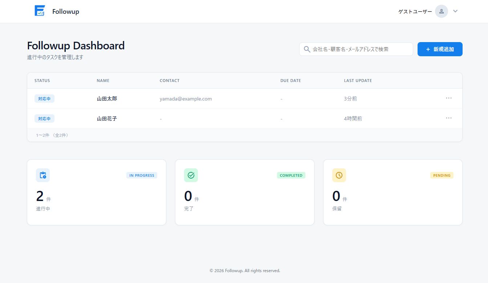
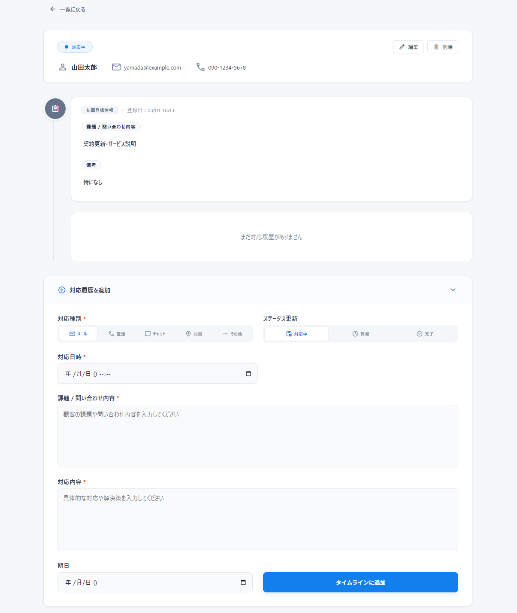
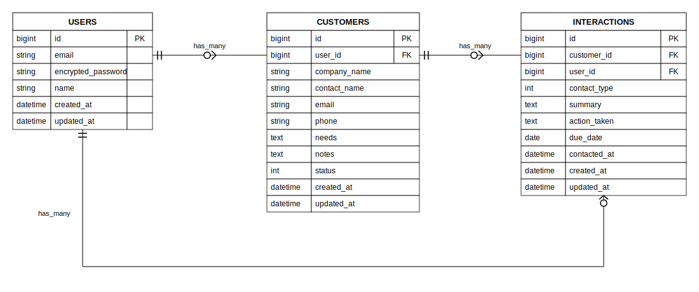

# Followup - 顧客対応履歴管理アプリ

## サービス概要

過去の対応履歴を記録・確認し、顧客対応をサポートするWebアプリです。

---

## サービス画像

---

## サービスURL
https://rails-followup-app.onrender.com
---

## アプリの説明

「Followup」は、顧客対応を簡単に記録・管理できるWebアプリです。タイムライン形式で過去の対応履歴を一覧表示し、一連のやり取りを時系列で確認できるのが特徴です。
ゲストログイン機能を用意しているため、アカウント登録なしでアプリの機能をお試しいただけます。

---

## 開発背景

営業やカスタマーサポートの現場で働いた経験から、顧客対応の記録・確認ができるツールの不足を感じたことがきっかけです。ノートやスプレッドシートでも記録はできますが、記録形式にばらつきが生じやすく、情報を統一して管理する仕組みが必要だと感じていました。

タイムライン形式で対応履歴や顧客の課題・問い合わせ内容を可視化することで、業務効率の向上につながると考え、本アプリを開発しました。シンプルさと視覚的なわかりやすさを重視した設計を意識しています。

---

## アプリの使い方

### 顧客管理
- 顧客の新規登録・編集・削除
- 会社名・顧客名・メールアドレス・電話番号・ステータスの管理
- ステータス管理（対応中・保留・完了）
- 顧客一覧の検索（会社名・顧客名・メールアドレス・ステータス）

### 対応履歴（タイムライン）
- タイムライン形式での対応履歴の確認
- 対応種別の記録（メール・電話・チャット・訪問・その他）
- 課題・問い合わせ内容と対応内容の記録
- 対応期限の設定・追加・削除

### アカウント管理
- ユーザー登録・ログイン・ログアウト
- プロフィール編集（氏名・メールアドレス・アイコン画像）
- ゲストログイン（アカウント登録不要でお試し可能）

---

## 工夫したポイント

### UI・UX
- 対応期限が48時間以内に迫った顧客を赤くハイライト表示し、優先対応が必要な顧客を一目で識別できるようにしました
- タイムライン形式で対応履歴を時系列に表示し、一連のやり取りを直感的に把握できるよう設計しました
- フラッシュ通知をフローティング形式で画面下部に表示し、操作結果をわかりやすく伝えるようにしました
- アイコン画像選択時にリアルタイムプレビューを表示し、保存前に確認できるようにしました

### 設計・実装
- ゲストユーザーには削除操作とアカウント設定を制限し、デモ用途でも安全にデータを保護できる設計にしました
- Kaminariによるページネーションと期限が近い顧客を優先表示するソートを組み合わせ、実用性を意識した一覧表示を実現しました
- i18nを活用してバリデーションメッセージ・フラッシュ通知・日付表示をすべて日本語化しました
- RSpecとFactoryBotによる自動テストを導入し、モデルのバリデーション・アソシエーション・リクエストの認証を27件のテストでカバーしました

---

## 使用技術

| カテゴリ | 技術 |
|---|---|
| フロントエンド | HTML / CSS / JavaScript |
| | Hotwire（Turbo / Stimulus） |
| バックエンド | Ruby 3.4.7 |
| | Ruby on Rails 7.2.3 |
| データベース | PostgreSQL |
| インフラ | Render |
| バージョン管理 | Git / GitHub |
| テスト | RSpec / FactoryBot |

---

## ER図

現在はユーザー・顧客・対応履歴の3つのテーブルで構築しています。ユーザーは複数の顧客を持ち、顧客は複数の対応履歴を持つ構成です。今後は対応履歴への画像添付機能の追加に伴い、Active Storageテーブルとの連携を拡張予定です。

---

## 今後の展望

### 直近の対応予定
- テストの拡充（認可テスト・ゲスト制限テスト・検索機能テスト）
- レスポンシブ対応

### 短期的な目標
- パスワードリセット機能の実装

### 中長期的な目標
- 対応履歴への画像添付機能
- チーム・複数ユーザーでの共有機能
